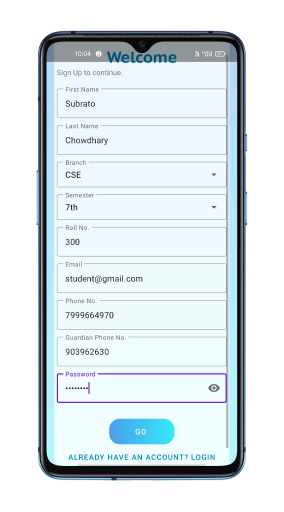
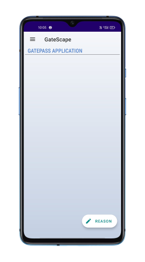
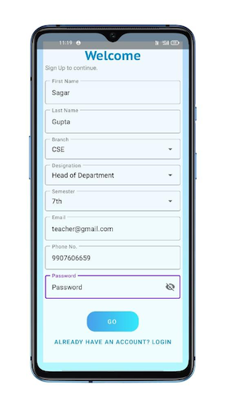

# Gate Escape

## Description

This project is an industrial training report on the development of a game called "Gate Escape". The report details the process of converting ideas and concepts into a practical system, and the experience gained during the project. The game was developed using Android Studio and features a character that must escape through a series of gates while avoiding obstacles.

## Installation

To install the game, follow these steps:

1. Download the latest version of Android Studio.
2. Clone the project repository.
3. Open the project in Android Studio.
4. Build and run the project on an Android device or emulator.

## Usage

To run the application, follow these steps:

1. Launch the application on an Android device.
2. Sign In as student or teacher.
3. Navigate through the gates while avoiding obstacles.
4. Collect coins to increase your score.

## Screenshots

## Credits

This project was completed as part of an industrial training program at E-TECH Designers & Developers PVT. LTD. The project was supervised by Praveen Kumar, and the author would like to thank the other working staff teachers for their valuable suggestions and support.

## License

This project is licensed under the [MIT License](https://opensource.org/licenses/MIT).
